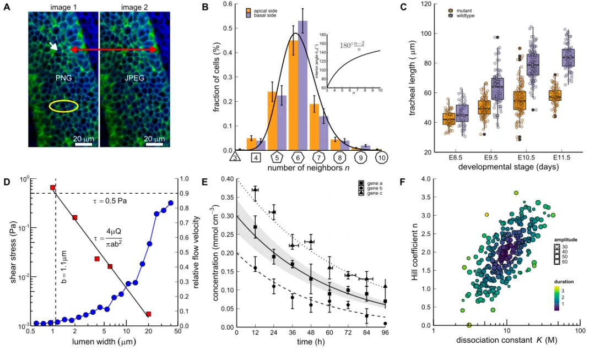

```{r setup, include=FALSE}
options(htmltools.dir.version = FALSE)
knitr::opts_chunk$set(
  fig.width=9, fig.height=3.5, fig.retina=3,
  out.width = "100%",
  cache = FALSE,
  echo = TRUE,
  message = FALSE, 
  warning = FALSE,
  hiline = TRUE
)
```

```{r xaringan-themer, include=FALSE, warning=FALSE}
library(xaringanthemer)
style_mono_light(base_color = "#23395b", link_color = "#EE81C3")
```

<!-- # ```{r xaringan-themer, include=FALSE, warning=FALSE} -->
<!-- # library(xaringanthemer) -->
<!-- # style_duo_accent( -->
<!-- #   primary_color = "#1381B0", -->
<!-- #   link_color = "#EE81C3", -->
<!-- #   secondary_color = "#FF961C", -->
<!-- #   inverse_header_color = "#FFFFFF" -->
<!-- # ) -->
<!-- # ``` -->


## 自我介绍

  .pull-left[
  
- 庄亮亮，[个人网站](https://zll-blog.netlify.app/)

- 浙江工商大学统计学（理学）博士生；

- 研究方向：可靠性统计、贝叶斯方法；

- 爱好：R语言相关（**可视化**，**文档沟通**）；

    ]
  
  .pull-right[
    
```{r,echo=FALSE,out.width="100%",fig.cap=""}

```

  ]
  


---

## 目录


  .pull-left[
  
### 1. 文献检索

#### 1.1 适合文献检索的网站

#### 1.2 持续跟踪最新工作

#### 1.3 适合查找代码的网站

### 2. 文献管理

  ]
  
  .pull-right[
    

### 3. 文献撰写

#### 3.1 LaTeX

#### 3.2 R Markdown

### 4. 绘图工具

#### 4.1 ggplot2 包入门教程

#### 4.2 科研绘图案例
  ]

- 主要参考：[适合研究生的科研步骤和技巧](https://mp.weixin.qq.com/s/0-LWAKsJv9Ue74YymHo_QQ)。

- 本文 HTML 可见：https://liangliangzhuang.github.io/Scientific-research/

---

class: inverse, middle, center

# 文献检索

---

### 适合文献检索的网站
    
  1. [Connected Papers](https://www.connectedpapers.com/)，当你要细究一篇 paper 时，你可以通过这个网站找到这篇文章的整个历史脉络。[教程](https://mp.weixin.qq.com/s/LKWnfFEsT-O1g3bM6n-5cg)
  
  2. [Paper Digest](https://www.paperdigest.org/)，只需输入关键字，该网站则会自动搜索相关文献，并提炼文献的关键观点和重要结果。[教程](https://mp.weixin.qq.com/s/p6Lm8DLJtk2nySfv8qpdTQ)
  
  3. [Research Rabbit](https://www.researchrabbit.ai/) 使用 AI 查找相关研究文章。[教程](https://www.bilibili.com/video/BV1fR4y1x7W3/?buvid=ZE460DE977775296462882B2716AE233679F&from_spmid=dt.space-search.video.0&is_story_h5=false&mid=ctD%2Fg0XG3IJ3mR6wVl5fig%3D%3D&p=1&plat_id=114&share_from=ugc&share_medium=iphone&share_plat=ios&share_session_id=175A98C9-EC5F-4671-95EB-BA763D954D28&share_source=COPY&share_tag=s_i&spmid=united.player-video-detail.0.0&timestamp=1698912950&unique_k=JeraRfD&up_id=226576305)

  .pull-left[
      
    ]
  
  .pull-right[
    
    ]
  
  


---

### 持续跟踪最新工作

  1.  [Google 学术](https://scholar.google.com/ "Google 学术")（[国内：谷粉学术](https://gfsoso.99lb.net/ "国内：谷粉学术")）、[Web of science](https://www.webofscience.com/wos/author/search "Web of science")、[Researchgate](https://www.researchgate.net/ "Researchgate") 等跟踪**学者**工作。
  
  2. [Inoreader](https://www.innoreader.com/starred)，[教程](https://mp.weixin.qq.com/s/MDwtTM10lugzF_6Q2KX-SQ)、[Researcher](https://www.researcher-app.com/) 跟踪**期刊**最新文章。

<!-- > **技巧**：使用以上网站持续关注某些大牛的工作。 -->

  .pull-left[
      
    ]
  
  .pull-right[
    
  ]


---

### 适合查找代码的网站

  1. [Papers with Code](https://paperswithcode.com/)，计算机类的 paper 和代码。[教程](https://mp.weixin.qq.com/s/ydmwgHoQeSnfJXA1aEihUQ)
 
  2. [Code Ocean](https://codeocean.com/) 是 Nature 推荐过的一个可重现性代码共享平台。
 
  .pull-left[
      
    ]
  
  .pull-right[
    
  ]


---


class: inverse, middle, center

# 文献管理

---


```{r,echo=FALSE,out.width="70%",fig.cap="使用 Endnote 管理文献", fig.align='center'}
knitr::include_graphics("figure/8.jpg")
```
    
> 相关推文：[文献与笔记管理](https://mp.weixin.qq.com/s?__biz=MzI1NjUwMjQxMQ==&mid=2247507967&idx=2&sn=ba8b4e884e52cd144f42d23a1c943f29&scene=21#wechat_redirect)、[自动导入文献](https://mp.weixin.qq.com/s?__biz=MzI1NjUwMjQxMQ==&mid=2247514385&idx=1&sn=d8426b65baa1dfa3588458ca18596a89&scene=21#wechat_redirect)、[批量导出 PDF](https://mp.weixin.qq.com/s?__biz=MzI1NjUwMjQxMQ==&mid=2247514445&idx=1&sn=8f5f052febf2a65f9a2a254b2dea8f19&scene=21#wechat_redirect)。

---

class: inverse, middle, center

# 文献撰写

---

<!-- - Word、**LaTeX**、**R Markdown** 等工具撰写文章。 -->

- **LaTeX**：专业的排版系统，适合处理篇幅较长、结构严谨的文档，擅长处理公式，。

- **R Markdown**：R 语言环境中提供的 markdown 编辑工具，*程序结果直接输出*。

- 共同优点：无需排版、通过代码解决、开源。

  .pull-left[
  
```{r,echo=FALSE,out.width="100%",fig.cap="LaTeX", fig.align='center'}

```
    ]
  
  .pull-right[
    
```{r,echo=FALSE,out.width="100%",fig.cap="R Markdown", fig.align='center'}

```

  ]


---

## LaTeX


相关教程：1. [LaTeX教程](https://mp.weixin.qq.com/s?__biz=MzI1NjUwMjQxMQ==&mid=2247506169&idx=1&sn=5672593d286379acd050575a74cff2b3&scene=21#wechat_redirect)、2. [多图排版笔记](https://mp.weixin.qq.com/s?__biz=MzI1NjUwMjQxMQ==&mid=2247505698&idx=1&sn=52bdfb019180d7b7c9d6a559447ffd71&scene=21#wechat_redirect)、3. [常用数学符号汇总](https://mp.weixin.qq.com/s?__biz=MzI1NjUwMjQxMQ==&mid=2247511519&idx=1&sn=0c552535b2e44b0e66578235b413349a&scene=21#wechat_redirect)、4. [适合撰写课程论文的 LaTeX 模板](https://mp.weixin.qq.com/s?__biz=MzI1NjUwMjQxMQ==&mid=2247517425&idx=2&sn=23e8b142e08a7b8a3a55a88a5895aac2&scene=21#wechat_redirect)


---

## Rmarkdown

1. [32 份 R 语言文档沟通推文汇总](https://mp.weixin.qq.com/s?__biz=MzI1NjUwMjQxMQ==&mid=2247514178&idx=1&sn=51a585fe8818494979019a837ef50923&scene=21#wechat_redirect)

2. [1.5w 字的 R Markdown 入门教程汇总](https://mp.weixin.qq.com/s?__biz=MzI1NjUwMjQxMQ==&mid=2247493762&idx=1&sn=b70a531122d0ee57fda44f0fbc9c742d&scene=21#wechat_redirect)

3. Bookdown中文书稿写作手册([（上）](https://mp.weixin.qq.com/s?__biz=MzI1NjUwMjQxMQ==&mid=2247497924&idx=1&sn=f55d05d91ab71b1a05769fc002aab692&scene=21#wechat_redirect), [（中）](https://mp.weixin.qq.com/s?__biz=MzI1NjUwMjQxMQ==&mid=2247498942&idx=1&sn=89ad5b8124f1a99f9942d4f945d52a5c&scene=21#wechat_redirect), [（下）](https://mp.weixin.qq.com/s?__biz=MzI1NjUwMjQxMQ==&mid=2247499154&idx=1&sn=d2e09db535b90f3cff84c67cf34751de&scene=21#wechat_redirect))


---

class: inverse, middle, center

# 绘图工具

---

## 常用绘图软件

- 使用 
R （[ggplot2](https://ggplot2.tidyverse.org/ "ggplot2")）、Python、matlab、[Visio](https://www.microsoft.com/zh-cn/microsoft-365/visio/flowchart-software "Visio")、[Hiplot](https://hiplot.com.cn/ "Hiplot")、[Echart](https://echarts.apache.org/zh/index.html "Echart") 等进行可视化。

- ggplot2 包介绍，特点。


---

## ggplot2 包

- **核心理念**：将绘图与数据分离，数据相关的绘图与数据无关的绘图分离，按 **图层**作图。

- 一句语句绘制一幅图，然后进行图层叠加 **“+”**。

- 包括 9 个部件：**数据** (data) 、**映射** (mapping)、**几何对象**、统计变换 (stats)、标度 (scale)、坐标系 (coord)、分面 (facet)、主题 (theme) 和存储和输出 (output)。

```{r,echo=FALSE,out.width="60%",fig.cap="", fig.align='center'}

```

---

### 简单案例

  .pull-left[
  
```{r,echo=FALSE,out.width="100%",fig.cap="散点图+拟合线", fig.align='center'}

```
    ]
  
  .pull-right[
    
```{r,echo=FALSE,out.width="100%",fig.cap="美化后的条形图", fig.align='center'}

```
  ]

- [常用 7 大类图形汇总](https://mp.weixin.qq.com/s?__biz=MzI1NjUwMjQxMQ==&mid=2247514010&idx=1&sn=9a230dfa326aa5fde7dac72f020e8137&scene=21#wechat_redirect)、[常用软件包](https://mp.weixin.qq.com/s?__biz=MzI1NjUwMjQxMQ==&mid=2247490661&idx=1&sn=10edad14326473d4274ebbb88ac43e61&scene=21#wechat_redirect)、[6 个 R 语言线上免费可视化资源](https://mp.weixin.qq.com/s?__biz=MzI1NjUwMjQxMQ==&mid=2247499161&idx=1&sn=5944db4a84878e29c75755b786bb59b9&scene=21#wechat_redirect)、[7 个在线 R 可视化资源](https://mp.weixin.qq.com/s?__biz=MzI1NjUwMjQxMQ==&mid=2247502900&idx=1&sn=4f391cc7adb63969bcffdf33cb8c3158&scene=21#wechat_redirect)。

---

### 高级绘图

```{r,echo=FALSE,out.width="70%",fig.cap="源码：https://github.com/marco-meer/scifig_plot_examples_R", fig.align='center'}

```


---


### 可用资源

- 推荐书籍：

1. ggplot2: Elegant Graphics for Data Analysis https://ggplot2-book.org/ 

2. Fundamentals of Data Visualization https://clauswilke.com/dataviz/

  .pull-left[
  
```{r,echo=FALSE,out.width="100%",fig.cap="R语言初级绘图教程", fig.align='center'}

```
    ]
  
  .pull-right[
    
```{r,echo=FALSE,out.width="100%",fig.cap="案例分析", fig.align='center'}

```
  ]

---


class: center, middle

# 蟹蟹

本幻灯片由 R 包 [**xaringan**](https://github.com/yihui/xaringan) 生成。


